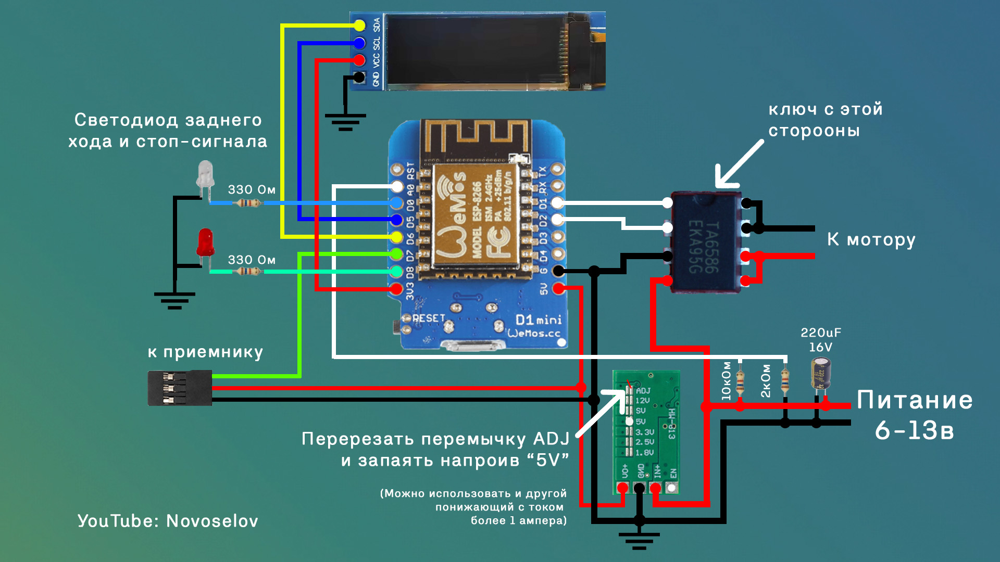

# Brushed-ESC-with-display

<!--  -->
## Описание

Проект "Brushed ESC with display" предназначен для создания регулятора оборотов (ESC) для коллекторных моторов с максимальным током до 7 ампер. Регулятор разработан для использования в радиоуправляемых машинках и имеет множество настроек через веб-интерфейс. Есть возможность подключения OLED I2C дисплея размером 0.91 дюйма для отрисовки всех параметров. Регулятор сделан на базе микроконтроллера ESP8266 и драйвера мотора TA6586.

 Видео на YouTube - "[Создание рабочей приборной панели для радиоуправляемой модели MN78 | Часть 2](https://youtu.be/tsTFnizV5i4?si=5KJ4gRqjkPQE3evj)"

## Возможности

- Плавное управление оборотами коллекторных моторов с током до 7А (подходит для моторов ~280 размера).

- Возможность точной настройки различных параметров через удобный веб-интерфейс.
- Возможность подключения OLED I2C дисплея размером 0.91 дюйма для отображения информации, аналогично приборной панели настоящего автомобиля.
- Поддержка активного тормоза (автоматическое включение тормоза при остановке машинки).
- Возможность подключения стоп-сигналов и индикации движения задним ходом.
- Мониторинг напряжения аккумулятора с возможностью точной настройки минимального и максимального напряжения для безопасной эксплуатации аккумулятора.
- Точная настройка старта мотора от определенной длительности ШИМ сигнала.

## Схема cборки

 Ссылка на схему в EasyEDA - "[EasyEDA](https://oshwlab.com/redbanannas)"

## Прошивка ESP8266 через Arduino IDE

#### Шаг 1: Установка Arduino IDE

1. Перейдите на официальный сайт [Arduino](https://www.arduino.cc/en/software).
2. Выберите версию Arduino IDE для вашей операционной системы (Windows, macOS или Linux) и скачайте установочный файл.
3. Установите Arduino IDE, следуя инструкциям на экране.

#### Шаг 2: Установка драйверов для ESP8266

1. Если у вас Windows, Вам, возможно, потребуется установить драйверы для USB-Serial преобразователя (например, CP2102 или CH340), используемого вашим ESP8266 модулем.
2. Драйверы можно скачать с сайтов производителей:

- [CP2102 драйверы](https://www.silabs.com/developers/usb-to-uart-bridge-vcp-drivers)
- [CH340 драйверы](http://www.wch.cn/downloads/category/5.html)

#### Шаг 3: Настройка Arduino IDE для работы с ESP8266

1. Запустите Arduino IDE.
2. Перейдите в меню **File (Файл) > Preferences (Настройки)**.
3. В поле **Additional Boards Manager URLs (Дополнительные URL-адреса менеджера плат)** введите следующий URL: `http://arduino.esp8266.com/stable/package_esp8266com_index.json`
4. Нажмите **OK**.

#### Шаг 4: Установка плат ESP8266

1. Перейдите в меню **Tools (Инструменты) > Board (Плата) > Boards Manager (Менеджер плат)**.
2. В поле поиска введите `ESP8266`.
3. Выберите "esp8266" от ESP8266 Community и нажмите **Install (Установить)**.
4. После установки закройте окно менеджера плат.

#### Шаг 5: Установка библиотеки GyverOLED

Инструкция по установке есть на странице библиотеки - <https://github.com/GyverLibs/GyverOLED?tab=readme-ov-file#install>

Скажем большое спасибо [Алексу](https://github.com/AlexGyver) за такую отличную и шуструю библиотеку! Без нее бы не получилось это реализовать

#### Шаг 6: Прошивка ESP8266

1. Скачайте прошивку ([тык сюда](https://github.com/NovoselovMilk/Brushed-ESC-with-display/archive/refs/heads/main.zip)) и откройте её с помощью Arduino IDE (возможно потребуется распаковать файл перед открытием)

2. Подключите ESP8266 модуль к компьютеру с помощью USB-кабеля.

3. В меню **Tools (Инструменты) > Board (Плата) > ESP8266 boards** выберите **LOLIN(WEMOS) d1 mini (clone)** и выберете порт, к которому подключена плате esp **Tools (Инструменты) > Port (Порт)**.
4. Нажмите на кнопку **Upload (Загрузить)** (стрелка вправо) для загрузки кода.

5. Дождитесь окончания загрузки. На экране будет сообщение **Done uploading (Загрузка завершена)**.
6. Загрузка завершена, поздравляю!

## Wi-Fi настройки

Включение точки доступа Wi-Fi происходит через 90 секунд, если не идет PWM сигнал от приемника (достаточно отсоединить от приемника управляющий провод)

- Название точки доступа - "ESC_SETTINGS"  
- Пароль - "12345678"

Для перехода на страницу с настройками необходимо подключиться к точке доступа и через браузер перейти на страницу 192.168.2.1  

### Страница с настройками регулятора

- **Max speed OLED** - Максимальная скорость отображаемая на дисплее.
- **LED** - Возможность отключения светодиода на плате WEMOS.
- **Brake (Auto Hold)** - Настройка автоматического торможения. В режиме "Switchable" переключение режима происходит при удержании тормоза более трех секунд.
- **PWM Mode** - Стандартный и расширенные режимы PWM. Для приемников ELRS - "std", для всех остальных - "wide".
- **Start forward PWM** - Значение PWM при котором мотор начинает вращение "вперед".
- **Start backward PWM** - Значение PWM при котором мотор начинает вращение "назад".
- **Reverse power** - Мощность мотора при движении задним ходом.
- **Bat control** - Функция отслеживания напряжения аккумулятора.
- **Min cell voltage** - Минимальное напряжение аккумулятора на одну ячейку.
- **Max cell voltage** - Максимальное напряжение аккумулятора на одну ячейку.
- **Battery type** - конфигурация аккумулятора(1S/2S)
- **Voltage calibration (optional)** - Калибровка напряжения аккумулятора. Необходимо замерить реальное напряжение аккумулятора и это значение вписать в поле.
